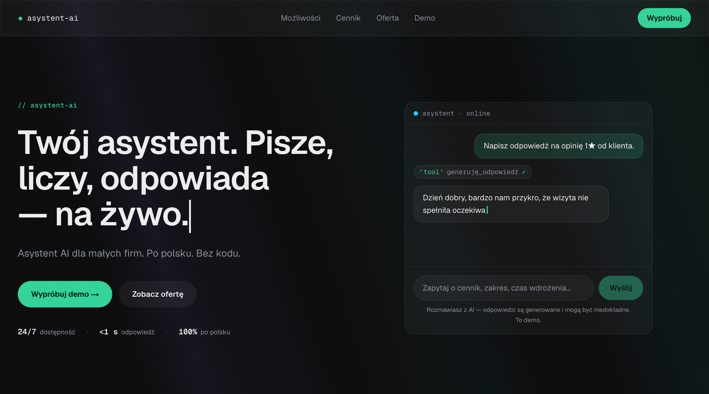

<h1 align="center">◆ Asystent AI</h1>

<p align="center">
  <strong>Asystent AI dla małych firm</strong> — chatbot Q&A odpowiadający klientom 24/7
  oraz generator spersonalizowanych ofert. Wszystko po polsku, ze streamingiem na żywo.
</p>

<p align="center">
  
  
  
  
  
</p>

<p align="center">
  
</p>

> **Demo do portfolio.** Pokazuje praktyczne zastosowanie LLM w obsłudze klienta i automatyzacji.
> **Działa od ręki bez żadnego klucza API** — w trybie `mock` odpowiedzi są realnie streamowane
> z zaślepki, więc strona nigdy nie zwraca błędu i nie generuje kosztów. Realny model (Claude / OpenAI)
> podłączasz jedną zmienną środowiskową.

---

## ✨ Funkcje

- **Chatbot Q&A na żywo** — okno czatu ze streamingiem (token po tokenie), odpowiada na pytania
  o cennik, zakres i czas wdrożenia na podstawie bazy wiedzy o firmie. Hero ze skryptowym podglądem
  „na żywo" + pełnoekranowe `/demo`.
- **Generator ofert** — z kilku pól (branża, zakres, budżet) składa spersonalizowaną ofertę,
  strumieniowo (`streamObject`), z kopiowaniem i eksportem do PDF (`/oferta`).
- **Provider-agnostic** — abstrakcja dostawcy LLM: `mock` (domyślnie), **Anthropic Claude** lub
  **OpenAI** — przełączasz jedną zmienną `AI_PROVIDER`, bez zmiany kodu.
- **Bezpieczeństwo demo** — klucz API **wyłącznie po stronie serwera**, rate-limiting po IP,
  twarde limity tokenów, walidacja wejścia, honeypot, widoczna nota „rozmawiasz z AI".
- **Design „Midnight Console"** — ciemny, techniczny motyw z akcentem emerald; animowane tło
  (świetlne smugi na canvasie), spotlight na kartach, dekodowanie nagłówków, liczniki w hero —
  **wszystko z poszanowaniem `prefers-reduced-motion`**.
- **SEO** — dynamiczne metadane, generowany OG image, `robots.txt`, `sitemap.xml`, JSON-LD.

## 🧱 Stack

| Warstwa | Technologia |
| --- | --- |
| Framework | **Next.js 16** (App Router, Route Handlers, View Transitions) |
| UI | **React 19**, **TypeScript 5**, **Tailwind CSS v4** (`@theme`), **framer-motion** |
| AI | **Vercel AI SDK 5** (`streamText` + `useChat`, `streamObject` + `useObject`), `@ai-sdk/anthropic`, `@ai-sdk/openai`, `zod` |
| Hosting | Vercel (Node runtime, streaming) |

## 🚀 Szybki start

Wymagania: **Node 20+** i npm.

```bash
git clone https://github.com/DawOrl/asystent-ai.git
cd asystent-ai
npm install
npm run dev
```

Otwórz **http://localhost:3000**. Działa od razu w trybie `mock` — **bez żadnego klucza API**.

## ⚙️ Konfiguracja (zmienne środowiskowe)

Skopiuj `.env.example` do `.env.local` i ustaw wedle potrzeb. Bez klucza działa tryb `mock`.

```bash
AI_PROVIDER=mock              # mock (domyślny) | anthropic | openai
ANTHROPIC_API_KEY=            # tylko serwer, BEZ prefiksu NEXT_PUBLIC_
OPENAI_API_KEY=               # alternatywny dostawca
NEXT_PUBLIC_SITE_URL=http://localhost:3000
# opcjonalny prod rate-limit (Upstash):
# UPSTASH_REDIS_REST_URL=
# UPSTASH_REDIS_REST_TOKEN=
```

| Tryb | Ustawienie | Efekt |
| --- | --- | --- |
| **Mock** (domyślny) | brak klucza | Canned odpowiedzi streamowane jak z modelu — $0, nigdy 500 |
| **Anthropic** | `AI_PROVIDER=anthropic` + `ANTHROPIC_API_KEY` | Claude Haiku 4.5 (najtańszy zdolny) |
| **OpenAI** | `AI_PROVIDER=openai` + `OPENAI_API_KEY` | tani model OpenAI |

> 🔒 Klucz API **nigdy nie trafia do przeglądarki** — endpointy (`/api/chat`, `/api/offer`) to
> serwerowe Route Handlery; sekrety nie mają prefiksu `NEXT_PUBLIC_`.

## 🗂️ Struktura projektu

```
src/
├── app/
│   ├── api/{chat,offer}/      # Route Handlery: streamText / streamObject (+ mock)
│   ├── demo/                  # pełnoekranowy czat
│   ├── oferta/                # generator ofert
│   ├── layout.tsx, page.tsx, globals.css
│   └── opengraph-image · robots · sitemap   # SEO
├── components/
│   ├── chat/                  # ChatPanel (useChat), ScriptedPreview, ChatInput…
│   ├── ui/                    # LightRays, SpotlightCard, DecodeText, CountUp, Reveal…
│   └── Hero, Features, HowItWorks, Pricing, Header, Footer
├── data/                      # company · knowledge (system prompt + FAQ) · offer · mock
└── lib/
    ├── ai/                    # provider (abstrakcja + mock model) · limits
    └── ratelimit · validate · schema · cn · motion
```

## 🔌 Architektura (w skrócie)

- **Czat:** `useChat` → `POST /api/chat` → `streamText(...).toUIMessageStreamResponse()`. Gdy brak
  klucza, route używa **ręcznie zbudowanego `LanguageModelV2`** (mock), więc ścieżka kodu jest jedna.
- **Oferty:** formularz → `POST /api/offer` → `streamObject(offerSchema)` → `useObject` renderuje
  częściowy obiekt na żywo.
- **Baza wiedzy:** prompt systemowy + FAQ w `data/knowledge.ts`. Zostawiony seam `retrieveContext()`
  pod RAG (embeddingi) na później.
- **Bezpieczeństwo:** rate-limit po IP (in-memory; Upstash jako prod-upgrade), limity tokenów/wejścia,
  honeypot, nota o AI (EU AI Act Art. 50).

## 📜 Skrypty

```bash
npm run dev      # serwer deweloperski (Turbopack)
npm run build    # build produkcyjny
npm run start    # serwer produkcyjny
npm run lint     # ESLint
```

## ☁️ Deploy (Vercel)

1. Zaimportuj repo na [vercel.com/new](https://vercel.com/new). Działa od razu w trybie `mock`.
2. (Opcjonalnie) Dodaj w ustawieniach env `AI_PROVIDER` + klucz dostawcy, by włączyć realny model.
3. Ustaw limit wydatków u dostawcy i w Vercel — to realne zabezpieczenie portfela przy publicznym demo.

## 👤 Autor

**Dawid Orłowski** — Fullstack AI Developer
[dorlowski.dev](https://dorlowski.dev) · [GitHub @DawOrl](https://github.com/DawOrl)

<sub>Projekt demonstracyjny do portfolio. Treści firmowe i ceny są przykładowe; odpowiedzi generuje AI.</sub>
